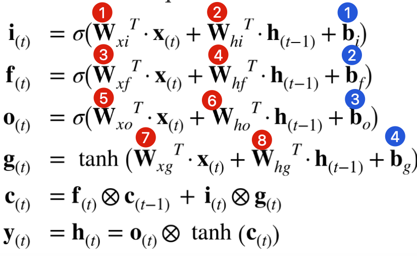
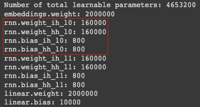
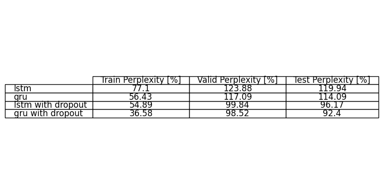

**[[EX2 - RNN]{.underline}]{dir="ltr"}**

**Theory**

**1.**

## Handling variable-length input sequences:

**Padding**: Add special tokens to shorter input sequences to make them
the same length as the longest sequence.

### **Bucketing**: Group input sequences by their length and pad them within each group, reducing the amount of padding needed overall.

### **Dynamic RNNs**: Use dynamic RNNs that can process sequences of different lengths within the same batch by processing only valid timesteps.

## Handling variable-length output sequences:

**Dynamic Output Length with End-of-Sequence Token**: Instead of padding
the sequences, you can generate the output dynamically until the
end-of-sequence token is predicted by the model. This way, the model can
produce sequences of variable lengths, terminating each sequence when
the end-of-sequence token is generated. This approach is often used in
tasks like text generation or machine translation, where the length of
the output sequence can vary.

**Padding**: Add special tokens to shorter input sequences to make them
the same length as the longest sequence.

**Bonus**: Use Transformers! 😎

**2.**

**Simpler architecture**: GRU has a simpler structure compared to LSTM.
It combines the input and forgets gates of LSTM into a single update
gate, reducing the number of gating units. As a result, GRU has fewer
parameters and is computationally more efficient.

**Faster training and inference:** Due to its simpler architecture, GRU
typically requires fewer computations during training and inference
compared to LSTM. This can lead to faster convergence during training
and faster predictions at runtime.

**Less prone to overfitting**: The simpler architecture of GRU makes it
less prone to overfitting on smaller datasets compared to LSTM. When the
available training data is limited, GRU can often achieve comparable or
better performance than LSTM.

**3.**

In the given scenario, the LSTM cell consists of **8 fully connected
layers**, each having 40,000 weight parameters (resulting from
multiplying the input size of 200 by the output size of 200).
Additionally, there are **4 bias vectors** with 200 parameters each.
Overall, the parameter count for the LSTM cell is calculated as 8
multiplied by 40,000, plus 4 multiplied by 200, resulting in a total of
320,800 parameters.

{width="3.25in"
height="2.082030839895013in"}

PyTorch\'s LSTM implementation employs two bias terms (b_ih and b_hh)
for each gate in the LSTM cell, in contrast to the single bias term used
in the provided assignment implementation.

Therefore, in the notebook, you will probably see different numbers of
weights:

{width="3.25in"
height="1.736719160104987in"}

# Since we are ignoring the bias terms, let's write the new equations based on the given GRU cell.

+---------------------+---+--------+---------+------+--------+--------+
| # $z_{(t)} = \sigm  |   |        | # } + { |   |        | l_d4a74 |      |        |        |
| W_{hz}}^{T} \cdot h |   |        | 92faf1b |      |        |        |
| _{(t - 1)} \right)$ |   |        | 49e8aeb |      |        |        |
|                     |   |        | 46f8413 |      |        |        |
| # $r_{(t)} = \sigm  |   |        | b2ceba/ |      |        |        |
| a\left( {W_{xr}}^{T |   |        | media/i |      |        |        |
| } \cdot x_{(t)} + { |   |        | mage3.p |      |        |        |
| W_{hr}}^{T} \cdot h |   |        | ng){wid |      |        |        |
| _{(t - 1)} \right)$ |   |        | th="2.3 |      |        |        |
|                     |   |        | 6in" he |      |        |        |
| # $g_{(t)           |   |        | ight="1 |      |        |        |
| } = tanh\left( {W_{ |   |        | .576814 |      |        |        |
| xg}}^{T} \cdot x_{( |   |        | 3044619 |      |        |        |
| t)} + {W_{hg}}^{T}  |   |        | 423in"} |      |        |        |
| \cdot \left( r_{(t) |   |        |         |      |        |        |
| } \otimes h_{(t - 1 |   |        |         |      |        |        |
| )} \right) \right)$ |   |        |         |      |        |        |
|                     |   |        |         |      |        |        |
| # $h_{(t)}          |   |        |         |      |        |        |
|  = z_{(t)} \otimes  |   |        |         |      |        |        |
| h_{(t - 1)} + \left |   |        |         |      |        |        |
| ( 1 - z_{(t)} \righ |   |        |         |      |        |        |
| t) \otimes g_{(t)}$ |   |        |         |      |        |        |
+=====================+===+========+=========+======+========+========+
| # Denote the fol    |   |        |         |      |        |        |
| lowing definitions, |   |        |         |      |        |        |
+---------------------+---+--------+---------+------+--------+--------+
| # $\delta_{(2)      | # |        |         | # $  |        |        |
| } \equiv \frac{\par |   |        |         | tanh |        |        |
| tial\epsilon_{(2)}} | $ |        |         | '(x) |        |        |
| {\partial h_{(2)}}$ | \ |        |         |  \eq |        |        |
|                     | s |        |         | uiv  |        |        |
| #                   | i |        |         | 1 -  |        |        |
| $\epsilon_{(2)} \eq | g |        |         | tanh |        |        |
| uiv \frac{1}{2} \cd | m |        |         | ^{2} |        |        |
| ot \left( h_{(2)} - | a |        |         | (x)$ |        |        |
|  y_{2} \right)^{2}$ | ( |        |         |      |        |        |
|                     | x |        |         |      |        |        |
|                     | ) |        |         |      |        |        |
|                     |   |        |         |      |        |        |
|                     | \ |        |         |      |        |        |
|                     | e |        |         |      |        |        |
|                     | q |        |         |      |        |        |
|                     | u |        |         |      |        |        |
|                     | i |        |         |      |        |        |
|                     | v |        |         |      |        |        |
|                     |   |        |         |      |        |        |
|                     | \ |        |         |      |        |        |
|                     | f |        |         |      |        |        |
|                     | r |        |         |      |        |        |
|                     | a |        |         |      |        |        |
|                     | c |        |         |      |        |        |
|                     | { |        |         |      |        |        |
|                     | 1 |        |         |      |        |        |
|                     | } |        |         |      |        |        |
|                     | { |        |         |      |        |        |
|                     | 1 |        |         |      |        |        |
|                     |   |        |         |      |        |        |
|                     | + |        |         |      |        |        |
|                     |   |        |         |      |        |        |
|                     | e |        |         |      |        |        |
|                     | ^ |        |         |      |        |        |
|                     | { |        |         |      |        |        |
|                     | - |        |         |      |        |        |
|                     |   |        |         |      |        |        |
|                     | x |        |         |      |        |        |
|                     | } |        |         |      |        |        |
|                     | } |        |         |      |        |        |
|                     | $ |        |         |      |        |        |
|                     |   |        |         |      |        |        |
|                     | # |        |         |      |        |        |
|                     |   |        |         |      |        |        |
|                     | $ |        |         |      |        |        |
|                     | \ |        |         |      |        |        |
|                     | s |        |         |      |        |        |
|                     | i |        |         |      |        |        |
|                     | g |        |         |      |        |        |
|                     | m |        |         |      |        |        |
|                     | a |        |         |      |        |        |
|                     | ' |        |         |      |        |        |
|                     | ( |        |         |      |        |        |
|                     | x |        |         |      |        |        |
|                     | ) |        |         |      |        |        |
|                     |   |        |         |      |        |        |
|                     | \ |        |         |      |        |        |
|                     | e |        |         |      |        |        |
|                     | q |        |         |      |        |        |
|                     | u |        |         |      |        |        |
|                     | i |        |         |      |        |        |
|                     | v |        |         |      |        |        |
|                     |   |        |         |      |        |        |
|                     | \ |        |         |      |        |        |
|                     | s |        |         |      |        |        |
|                     | i |        |         |      |        |        |
|                     | g |        |         |      |        |        |
|                     | m |        |         |      |        |        |
|                     | a |        |         |      |        |        |
|                     | ( |        |         |      |        |        |
|                     | x |        |         |      |        |        |
|                     | ) |        |         |      |        |        |
|                     |   |        |         |      |        |        |
|                     | \ |        |         |      |        |        |
|                     | c |        |         |      |        |        |
|                     | d |        |         |      |        |        |
|                     | o |        |         |      |        |        |
|                     | t |        |         |      |        |        |
|                     |   |        |         |      |        |        |
|                     | \ |        |         |      |        |        |
|                     | l |        |         |      |        |        |
|                     | e |        |         |      |        |        |
|                     | f |        |         |      |        |        |
|                     | t |        |         |      |        |        |
|                     | ( |        |         |      |        |        |
|                     |   |        |         |      |        |        |
|                     | 1 |        |         |      |        |        |
|                     |   |        |         |      |        |        |
|                     | - |        |         |      |        |        |
|                     |   |        |         |      |        |        |
|                     | \ |        |         |      |        |        |
|                     | s |        |         |      |        |        |
|                     | i |        |         |      |        |        |
|                     | g |        |         |      |        |        |
|                     | m |        |         |      |        |        |
|                     | a |        |         |      |        |        |
|                     | ( |        |         |      |        |        |
|                     | x |        |         |      |        |        |
|                     | ) |        |         |      |        |        |
|                     |   |        |         |      |        |        |
|                     | \ |        |         |      |        |        |
|                     | r |        |         |      |        |        |
|                     | i |        |         |      |        |        |
|                     | g |        |         |      |        |        |
|                     | h |        |         |      |        |        |
|                     | t |        |         |      |        |        |
|                     | ) |        |         |      |        |        |
|                     | $ |        |         |      |        |        |
+---------------------+---+--------+---------+------+--------+--------+

c.  ## $\frac{\partial\epsilon_{(2)}}{\partial W_{xz}} = \frac{\partial\epsilon_{(2)}}{\partial h_{(2)}} \cdot \frac{\partial h_{(2)}}{\partial z_{(2)}} \cdot \frac{\partial z_{(2)}}{\partial W_{xz}} =$ $= \delta_{(2)} \cdot \left( h_{(1)} - g_{(2)} \right) \cdot \sigma'\left( {W_{xz}}^{T} \cdot x_{(2)} + {W_{hz}}^{T} \cdot h_{(1)} \right) \cdot x_{(2)}$

d.  ## $\frac{\partial\epsilon_{(2)}}{\partial W_{hz}} = \frac{\partial\epsilon_{(2)}}{\partial h_{(2)}} \cdot \frac{\partial h_{(2)}}{\partial z_{(2)}} \cdot \frac{\partial z_{(2)}}{\partial W_{xz}} =$ $= \delta_{(2)} \cdot \left( h_{(1)} - g_{(2)} \right) \cdot \sigma'\left( {W_{xz}}^{T} \cdot x_{(2)} + {W_{hz}}^{T} \cdot h_{(1)} \right) \cdot h_{(2)}$

e.  ## $\frac{\partial\epsilon_{(2)}}{\partial W_{xg}} = \frac{\partial\epsilon_{(2)}}{\partial h_{(2)}} \cdot \frac{\partial h_{(2)}}{\partial g_{(2)}} \cdot \frac{\partial g_{(2)}}{\partial W_{xg}} =$ $= \delta_{(2)} \cdot \left( 1 - z_{(2)} \right) \cdot tanh'\left( {W_{xg}}^{T} \cdot x_{(2)} + {W_{hg}}^{T} \cdot \left( r_{(2)} \otimes h_{(1)} \right) \right) \cdot x_{(2)}$

f.  ## $\frac{\partial\epsilon_{(2)}}{\partial W_{hg}} = \frac{\partial\epsilon_{(2)}}{\partial h_{(2)}} \cdot \frac{\partial h_{(2)}}{\partial g_{(2)}} \cdot \frac{\partial g_{(2)}}{\partial W_{hg}} =$ $= \delta_{(2)} \cdot \left( 1 - z_{(2)} \right) \cdot tanh'\left( {W_{xg}}^{T} \cdot x_{(2)} + {W_{hg}}^{T} \cdot \left( r_{(2)} \otimes h_{(1)} \right) \right) \cdot r_{(2)} \otimes h_{(1)}$

g.  ## $\frac{\partial\epsilon_{(2)}}{\partial W_{xr}} = \frac{\partial\epsilon_{(2)}}{\partial h_{(2)}} \cdot \frac{\partial h_{(2)}}{\partial g_{(2)}} \cdot \frac{\partial g_{(2)}}{\partial r_{(2)}} \cdot \frac{\partial r_{(2)}}{\partial W_{xr}} =$ $= \delta_{(2)} \cdot \left( 1 - z_{(2)} \right) \cdot tanh'\left( {W_{xg}}^{T} \cdot x_{(2)} + {W_{hg}}^{T} \cdot \left( r_{(2)} \otimes h_{(1)} \right) \right) \cdot {W_{hg}}^{T} \cdot h_{(1)} \cdot \sigma'\left( {W_{xr}}^{T} \cdot x_{(t)} + {W_{hr}}^{T} \cdot h_{(t - 1)} \right){\cdot x}_{(2)}$

h.  ## $\frac{\partial\epsilon_{(2)}}{\partial W_{hr}} = \frac{\partial\epsilon_{(2)}}{\partial h_{(2)}} \cdot \frac{\partial h_{(2)}}{\partial g_{(2)}} \cdot \frac{\partial g_{(2)}}{\partial r_{(2)}} \cdot \frac{\partial r_{(2)}}{\partial W_{hr}} =$ $= \delta_{(2)} \cdot \left( 1 - z_{(2)} \right) \cdot tanh'\left( {W_{xg}}^{T} \cdot x_{(2)} + {W_{hg}}^{T} \cdot \left( r_{(2)} \otimes h_{(1)} \right) \right) \cdot {W_{hg}}^{T} \cdot h_{(1)} \cdot \sigma'\left( {W_{xr}}^{T} \cdot x_{(t)} + {W_{hr}}^{T} \cdot h_{(t - 1)} \right){\cdot h}_{(1)}$

#  

**Practical**

Below is a table displaying the convergence graphs for test versus train
perplexity for each technique utilized in the training of the LSTM and
GRU networks.

+----------------+----------------+-----------------+-----------------+
| **LSTM**       |                | **LSTM -        |                 |
|                |                | Dropout**       |                 |
+================+================+=================+=================+
| **Optimizer:** |  | SGD             | edia/image7.png |
|                | {width="1.4in" |                 | ){width="1.4in" |
|                | he             | **Learning      | height="1.00799 |
|                | ight="1.022000 | Rate:** 1↓      | 97812773402in"} |
|                | 2187226596in"} |                 |                 |
+----------------+----------------+-----------------+-----------------+
| { |                | dia/image8.png) |                 |
| width="2.35in" |                | {width="2.35in" |                 |
| he             |                | height="1.99510 |                 |
| ight="1.995101 |                | 17060367453in"} |                 |
| 7060367453in"} |                |                 |                 |
|                |                | > **Train:**    |                 |
| > **Train:**   |                | > train/R       |                 |
| > train/RNN    |                | NN_lstm_dpTrue\ |                 |
| _lstm_dpFalse\ |                | > **Test:**     |                 |
| > **Test:**    |                | > test/train/R  |                 |
| >              |                | NN_lstm_dpTrue\ |                 |
| test/train/RNN |                | > **Val:**      |                 |
| _lstm_dpFalse\ |                | > val/train/    |                 |
| > **Val:**     |                | RNN_lstm_dpTrue |                 |
| > val/train/RN |                |                 |                 |
| N_lstm_dpFalse |                |                 |                 |
+----------------+----------------+-----------------+-----------------+
| **GRU**        |                | **GRU -         |                 |
|                |                | Dropout**       |                 |
+----------------+----------------+-----------------+-----------------+
| **Optimizer:** |  | Adam            | edia/image5.png |
|                | {width="1.4in" |                 | ){width="1.4in" |
|                | he             | **Learning      | height="1.00799 |
|                | ight="1.012162 | Rate:** 0.001↓  | 97812773402in"} |
|                | 0734908137in"} |                 |                 |
+----------------+----------------+-----------------+-----------------+
| { |                | dia/image6.png) |                 |
| width="2.35in" |                | {width="2.35in" |                 |
| he             |                | height="1.99510 |                 |
| ight="1.995101 |                | 17060367453in"} |                 |
| 7060367453in"} |                |                 |                 |
|                |                | > **Train:**    |                 |
| > **Train:**   |                | > train/R       |                 |
| > train/RN     |                | NN_gru_dpFalse\ |                 |
| N_gru_dpFalse\ |                | > **Test:**     |                 |
| > **Test:**    |                | > test/train/R  |                 |
| >              |                | NN_gru_dpFalse\ |                 |
|  test/train/RN |                | > **Val:**      |                 |
| N_gru_dpFalse\ |                | > val/train/    |                 |
| > **Val:**     |                | RNN_gru_dpFalse |                 |
| > val/train/R  |                |                 |                 |
| NN_gru_dpFalse |                |                 |                 |
+----------------+----------------+-----------------+-----------------+

**Summarized Table**

{width="6.0in"
height="0.7577395013123359in"}

**Conclusions**

+----------------------------------+-----------------------------------+
| **Train Set Perplexity**         | **Validation Set Perplexity**     |
+==================================+===================================+
| {width="2.35in" | media/image11.png){width="2.35in" |
| height="1.9951017060367453in"}   | height="1.9951017060367453in"}    |
|                                  |                                   |
| 1.  LSTM                         | 1.  LSTM                          |
|                                  |                                   |
| 2.  GRU                          | 2.  GRU                           |
|                                  |                                   |
| 3.  LSTM + Dropout               | 3.  LSTM + Dropout                |
|                                  |                                   |
| 4.  GRU + Dropout                | 4.  GRU + Dropout                 |
+----------------------------------+-----------------------------------+

Based on the results of the experiment comparing the performance of
different Recurrent Neural Network (RNN) models, we can conclude the
following:

-   **Model Comparison**: The GRU models consistently outperformed the
    LSTM models across all three dataset partitions: training,
    validation, and testing. This might be due to the GRU\'s simpler
    architecture, which can often learn similar representations to LSTM
    with less risk of overfitting and in less time. However, this does
    not necessarily mean that GRUs are always superior to LSTMs, as the
    performance can vary depending on the specific task and dataset.

-   **Effect of Dropout**: Adding dropout significantly improved the
    performance of both LSTM and GRU models. This suggests that the
    original models without dropout may have been overfitting to the
    training data. By using dropout, the models become more robust and
    generalize better to unseen data, as evidenced by the lower
    perplexity scores on the validation and test sets.

-   **Training Time**: The LSTM with dropout took significantly more
    epochs to train (75) compared to the other models. This could be due
    to the additional complexity introduced by the dropout layers, which
    may slow down the convergence of the model. However, despite the
    longer training time, this model achieved better performance than
    the LSTM without dropout. The GRU with dropout, using the Adam
    optimizer, took fewer epochs (40) to train, suggesting that this
    combination might be more efficient.

-   **Optimizer Impact**: The GRU model with dropout and Adam optimizer
    achieved the best results across all perplexity measures, suggesting
    that the Adam optimizer might be better suited for GRU in this task
    compared to SGD. Adam, which incorporates the benefits of other
    optimization methods with an adaptive learning rate, might provide
    better and quicker convergence in this case.

In summary, these results suggest that for this particular task and
dataset, a GRU architecture with dropout and the Adam optimizer provides
the best performance in terms of perplexity. Furthermore, the use of
dropout appears to be an effective technique for improving the
generalization of both LSTM and GRU models.

**References**

\[1\] [[LSTM --- PyTorch 2.0
documentation]{.underline}](https://pytorch.org/docs/stable/generated/torch.nn.LSTM.html)

\[2\] [[Speed up your RNN with Sequence Bucketing \|
Kaggle]{.underline}](https://www.kaggle.com/code/bminixhofer/speed-up-your-rnn-with-sequence-bucketing)

\[3\] [[Dynamic Recurrent Neural Network (LSTM) · TensorFlow Examples
(aymericdamien)
(gitbooks.io)]{.underline}](https://wizardforcel.gitbooks.io/tensorflow-examples-aymericdamien/content/3.08_dynamic_rnn.html)

\[4\] [[What is Teacher Forcing for Recurrent Neural Networks? -
MachineLearningMastery.com]{.underline}](https://machinelearningmastery.com/teacher-forcing-for-recurrent-neural-networks/#:~:text=Teacher%20forcing%20is%20a%20strategy,be%20trained%20with%20teacher%20forcing.)

\[5\] [[The Complete Guide To Moving EOS Tokens Off Of Exchanges \| by
Kevin Rose \| EOS New York \|
Medium]{.underline}](https://medium.com/eos-new-york/the-complete-guide-for-moving-eos-tokens-off-of-exchanges-4c40b6155ecd)

\[6\] [[The Ultimate Showdown: RNN vs LSTM vs GRU - Which is the Best? -
Shiksha
Online]{.underline}](https://www.shiksha.com/online-courses/articles/rnn-vs-gru-vs-lstm/)
